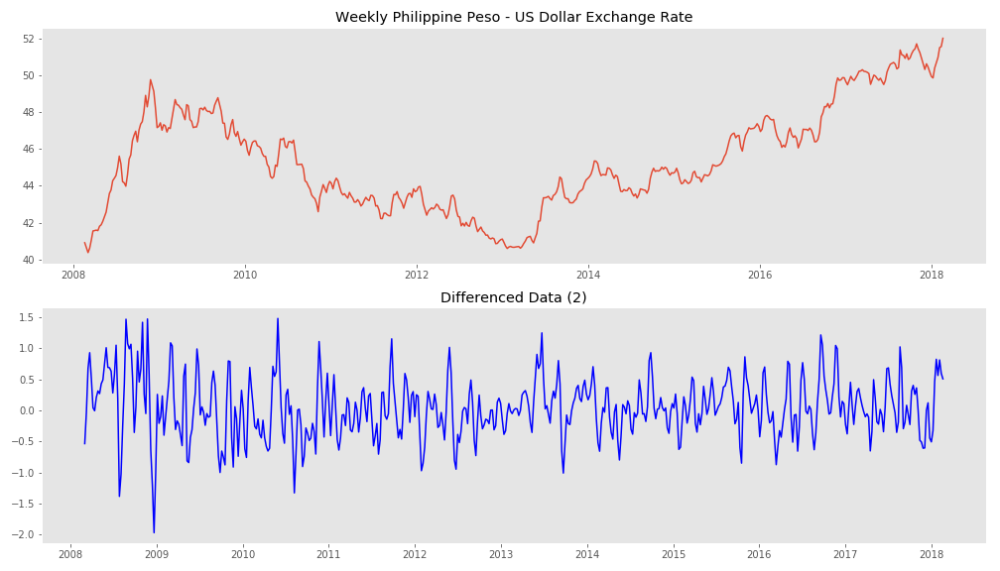
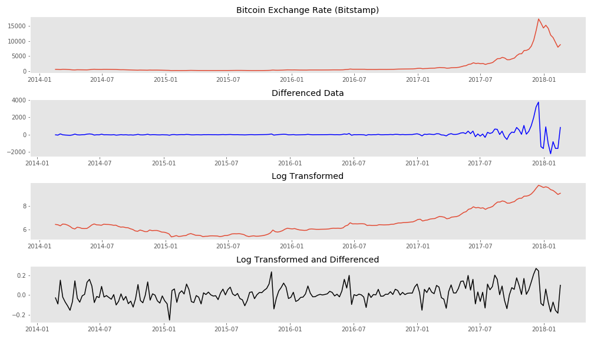
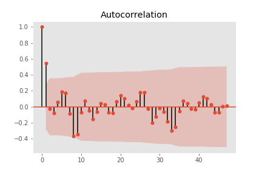
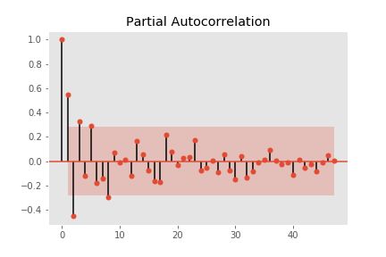
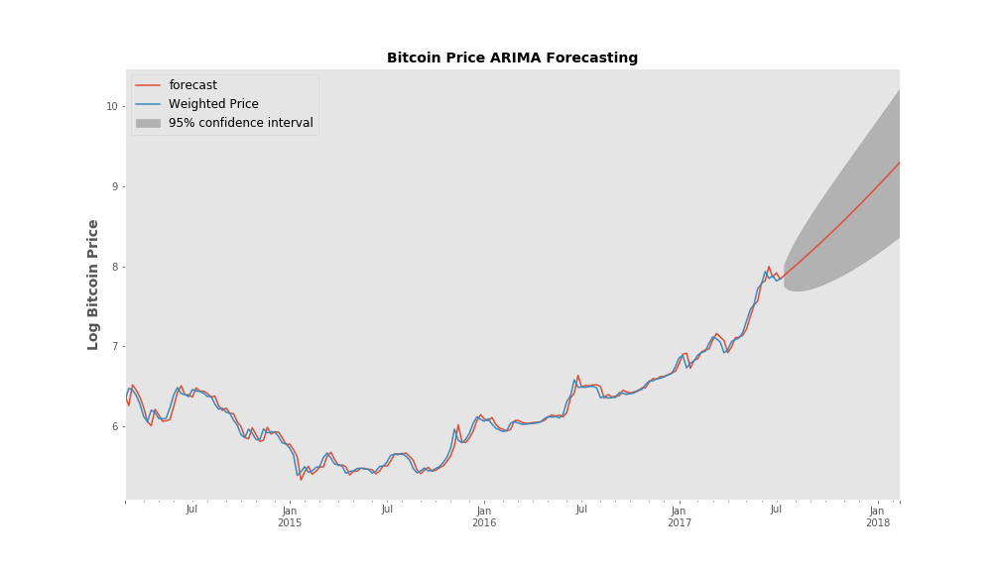
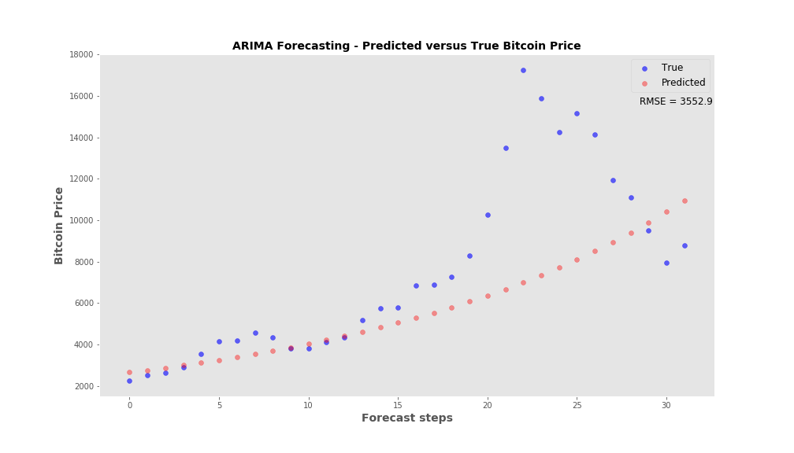
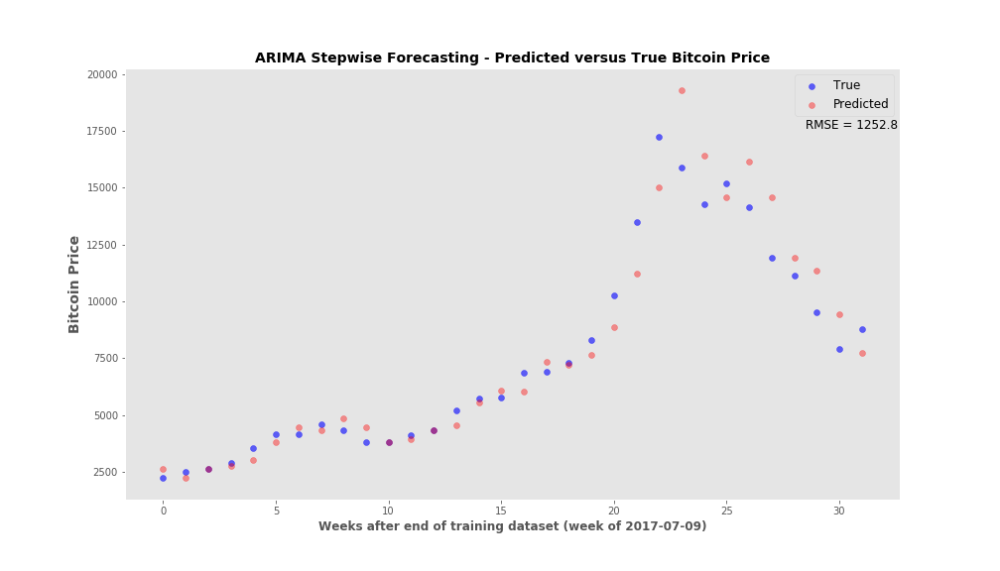

## Time series analysis and Currency Predictive Analytics
---
### Goal
To understand the intricacies of using ARIMA (Autoregressive Integrated Moving Average) and implement a model that can be used to forecast the future prices of two forms of currency - the Phillippine Peso and Bitcoin - against the US Dollar.

### Data Sourcing and Preparation
Historical Exchange Rate for the Philippine Peso was obtained from the freely available dataset in the [OFX website](https://www.ofx.com/en-us/forex-news/historical-exchange-rates/). Exchange rates for the last 10 years was downloaded and used for the first analysis.

The bitcoin exchange rate was downloaded from a website that provides some free financial data and I downloaded the Bitstamp Exchange [dataset](https://www.quandl.com/data/BCHARTS/BITSTAMPUSD-Bitcoin-Markets-bitstampUSD).  

The data that I obtained was pretty clean and most of the manipulation/exploration I performed involved resampling the data to obtain weekly averages. This was mostly done to maintain a constant time series. I could have easily done the analysis from the daily data. In fact, for the bitcoin data, I did try an analysis of the daily price but truncated the time span to just get the past year's daily opening price.

Finally, I chose these two exchange rates because their rate fluctuations are totally different.  The Philippine Peso exchange rate fluctuated mildly over time while the bitcoin price showed a very sharp increase at the end that is still very volatile in the current market. I wanted to know if these two different time series datasets required different analyses for the modeling.

### Modeling
I used the Autoregressive Integrated Moving Average (ARIMA) model in both exchange rate data.  To use ARIMA, I had to transform each dataset to obtain a stationary time series.

**Philippine Peso Stationarity**
In the case of the Peso data, I obtained a stationary time series by a simple differencing step.

---
Using the Augmented Dickey-Fuller Test (ADF) for stationarity, the p-values were as follows.

**Philippine Peso Stationarity Test**

|Transformation | ADF p-value |
|:-------------:|:-----------:|
|None|50.2|
|Differenced(1)|2.7e-10|
|Differenced(2)|9.2e-08|

---
**Bitcoin Stationarity**
For the bitcoin data, the huge price increase at the most recent time periods required a log transformation. Differencing of the log transformed data yielded stationarity and is shown in the table below.

**Bitcoin Stationarity Test**
---

|Transformation | ADF p-value |
|:-------------:|:-----------:|
|Untransformed  |1.0          |
|Untransformed Differenced (1)|0.74|
|Log-transformed|0.99|
|Log-transformed Differenced (1)|3.0e-18|
|Log-Transformed Differenced (2)|2.07e-05|
---
#### **Autocorrelation and Partial Autocorrelation Plots**
---
##### Bitcoin Log-Transformed and Second-order Differenced Data
 |

---
##### **ARIMA(p, d, q) value selection**
---
##### The PACF and ACF plots suggest that an AR(2) and MA(1) model is appropriate. Based on the augmented Dickey-Fuller analysis of the log-transformed data, stationarity is achieved at both first and second-order differencing. I therefore tried an ARIMA(1,1,1) initially. However, upon further analysis, an ARIMA(1,2,1) model yielded a lower Akaike Information Criteria (AIC) score and had better cross-validation performance.
---
#### Validation
**Bitcoin ARIMA model Validation** The same validation was done with the Philippine Peso data and can be viewed in the accompanying Jupyter Notebook.

For the bitcoin price data, the ARIMA model was trained on the first 85% of the dataset.  ARIMA's forecasting function yielded the plot shown here.

The next plot shows only the **32 week period** past the training data set which compares the actual bitcoin price against the forecast price. An RMSE of the true and predicted values is noted as well.

Alternatively, with a test set that has n number of time points, I used the trained model to forecast **only** the immediate time point (t1). I then retrained the model with the true value for t1 added to the training set, and use the newly fitted model for the next forecast (for t2). This was repeated until predictions for all n time points are obtained. This set of stepwise predictions had a lower root mean squared error compared to doing all test set predictions at once. 

The ARIMA models that were built in this short analysis performed as expected i.e. the forecasting capability of each model was fairly good at the immediate time point following the training dataset. If we extend the forecast more time points, the predictions deviate rather markedly, especially in the bitcoin analysis since we enter the time period with the most volatile price increases/drops. However, predicting only one time point ahead and updating the model constantly showed a marked decrease in the root mean squared error.

#### Deployment

 Currency speculation is very risky. Despite the acceptable predictive performance of the ARIMA model built in this exercise, a possibly better predictive model can be built if we incorporate other data that reflect factors known to affect currency exchange rate. This is of course a bit hard with cryptocurrency because there is currently little data on what can or has fueled the recent high fluctuations. At any rate, this has been a fun exercise.
