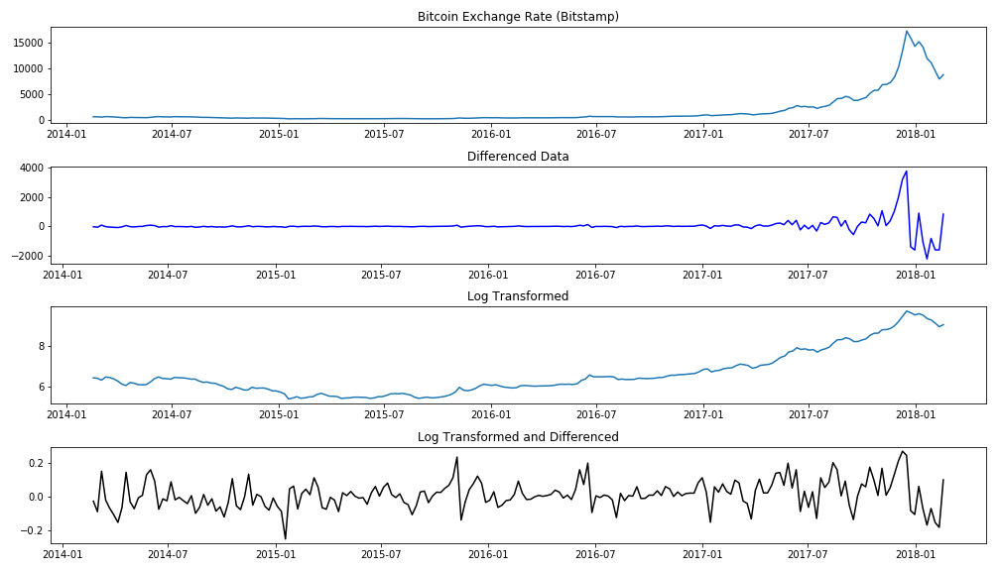

## A Repo for time series analysis of Bitcoin Price
---
### Goal
To understand the intricacies of using ARIMA (Autoregressive Integrated Moving Average) and implement a model that can be used to forecast the future prices of two forms of currency - the Phillippine Peso and Bitcoin - against the US Dollar.

### Data Sourcing and Preparation
Historical Exchange Rate for the Philippine Peso was obtained from the freely available dataset in the [OFX website](https://www.ofx.com/en-us/forex-news/historical-exchange-rates/). Exchange rates for the last 10 years was downloaded and used for the first analysis.

The bitcoin exchange rate was downloaded from a website that provides some free financial data and I downloaded the Bitstamp Exchange [dataset](https://www.quandl.com/data/BCHARTS/BITSTAMPUSD-Bitcoin-Markets-bitstampUSD).  

The data that I obtained was pretty clean and most of the manipulation/exploration I performed involved resampling the data to obtain weekly averages. This was mostly done to maintain a constant time series. I could have easily done the analysis from the daily data. In fact, for the bitcoin data, I did try an analysis of the daily price but truncated the time span to just get the past year's daily opening price.

Finally, I chose these two exchange rates because their rate fluctuations are totally different.  The Philippine Peso exchange rate fluctuated mildly over time while the bitcoin price showed a very sharp increase at the end that is still very volatile in the current market. I wanted to know if these two different time series datasets required different analyses for the modeling.

### Modeling
I used the Autoregressive Integrated Moving Average (ARIMA) model in both exchange rate data.  To use ARIMA, I had to transform each dataset to obtain a stationary time series. In the case of the Peso data, I obtained a stationary time series by a simple differencing step. Using the Augmented Dickey-Fuller Test for stationarity, the p-values were as follows.
|Transformation | ADF p-value |
|:-------------:|:-----------:|
|None|50.2|
|Differenced(1)|2.7e-10|
|Differenced(2)|9.2e-08|

For the bitcoin data, the huge price increase at the most recent time periods required a log transformation.

